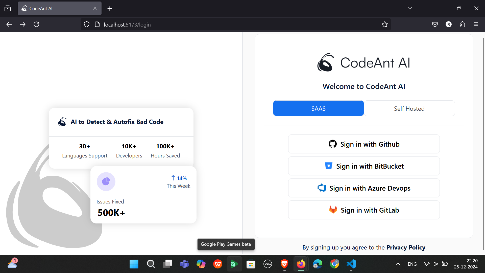
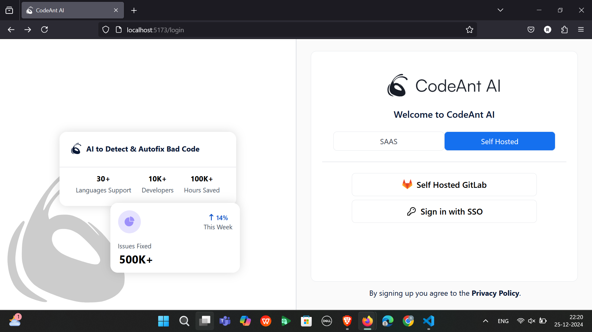
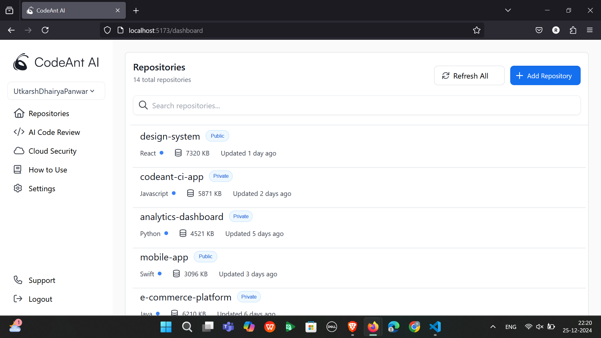
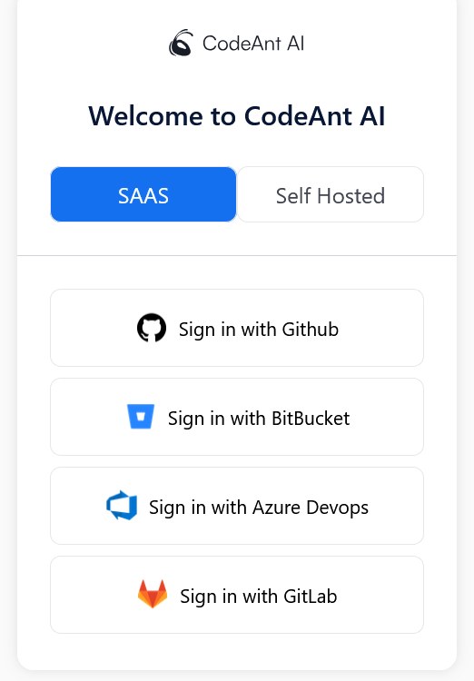
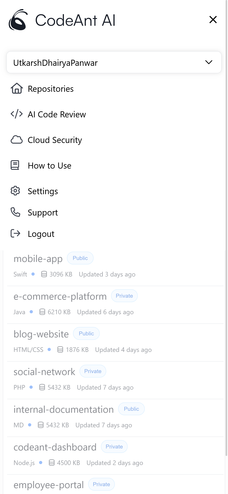
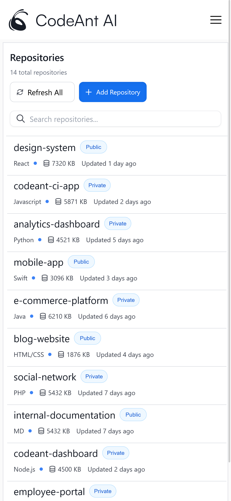

# CodeAnt_AI_Frontend_Assignment

This repository contains the frontend implementation of the assigned tasks, built using modern web technologies to ensure a responsive and seamless user experience.

## Frontend Setup
### Installation
1. Open a new terminal for the frontend setup.
2. Run the following command to install dependencies:
   ```bash
   npm install
   ```

### Startup
To start the frontend server, run:
```bash
npm dev run
```
- This will launch the application in your browser.
- Default URL: **http://localhost:5173**

---

## Technologies Used
- **Frontend:** React.js, javaScript, HTML
- **Styling:** CSS
- **Icons:** React Icons

## Images








## Contact
If you have any questions or encounter issues, feel free to reach out to me:
- **Name:** Kurapati Rithish
- **Email:** rithishkurapati72@gmail.com

---

**Thank you for checking out the project!** 

